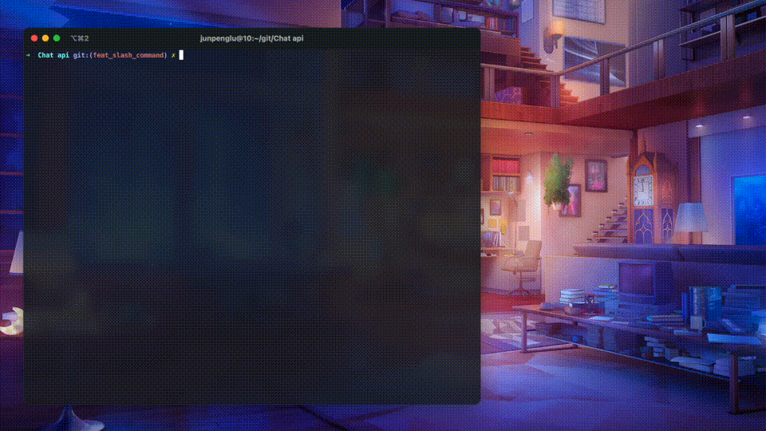
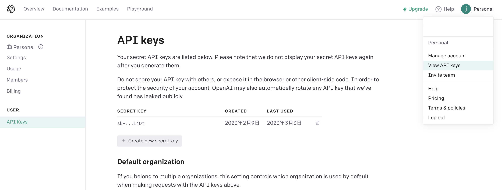

# Chat with GPT in terminal

[](./README.md)
[](./README.zh-CN.md)
[]()
[](https://github.com/RichardLitt/standard-readme)

This project implements a ChatGPT chatbot in the terminal. 

- The Markdown content in the responses is rendered as beautiful rich text

- Historical questions can be retrieved via the up/down arrow
- Optional multi-line queries
- Token counting



The latest [gpt-3.5-turbo](https://platform.openai.com/docs/guides/chat/chat-completions-beta) model is used, which is the model used by ChatGPT (rather than the previous generation `text-davinci-003` model).

## Install

1. Clone the repo and navigate to the directory:

   ```shell
   git clone https://github.com/xiaoxx970/chatgpt-in-terminal.git
   cd ./chatgpt-in-terminal
   ```

2. In the `.env` file at the root of the project, write the OPENAI_API_KEY variable, as follows:

   ```
   OPENAI_API_KEY=your-API-KEY
   ```

   OpenAI's key can be generated on the page that opens when you click `View API keys` in the top right corner of the main page.

   

3. Install dependencies via requirements.txt:

   ```shell
   pip3 install -r requirements.txt
   ```

## Usage

Run the following command to start the bot:

```shell
python3 chat.py
```

### Multi-line mode

If the question requires multi-line input, run with the `-m` parameter:

```shell
python3 chat.py -m
```

In multi-line mode, press Enter to move to the next line, and if you press Enter on a blank line, the question will be submitted.

### Raw mode

If you want answers that are not rendered with Markdown, run with the `-raw` parameter:

(the conversation record in its original format is also stored in `chat.log`.)

```shell
python3 chat.py -raw
```

> Multi-line and raw modes can be used simultaneously.

### Exit word

In the chat, you can end the session with an exit word, which can be:

```python
['再见', 'bye', 'goodbye', '结束', 'end', '退出', 'exit']
```

The exit word will be sent as a question to ChatGPT, and the bot will exit after GPT provides an answer.

You can also use `Ctrl-C` or `Ctrl-D` to exit immediately.

After exiting, the bot will display the token count used in the chat.

> Currently priced at: $0.002 / 1K tokens, the free version has a speed limit of: 20 times / min.

## Project structure

```
├── README.md           # Documentation file
├── chat.py             # Project code
├── requirements.txt    # List of dependencies
├── chat.log            # Log file generated after chatting
└── .env                # Key storage file
```

## License

This project is licensed under the [MIT License](https://chat.openai.com/LICENSE).